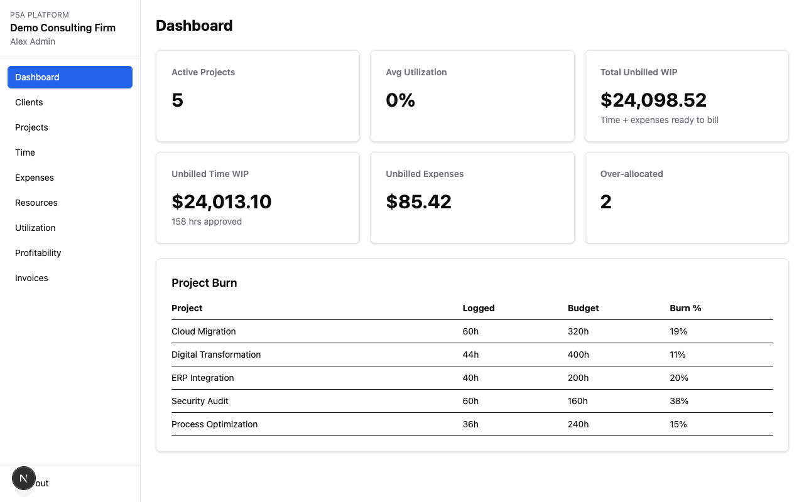
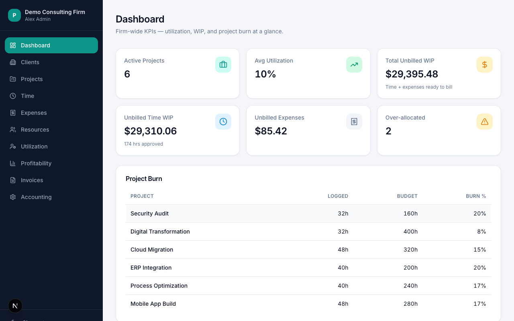
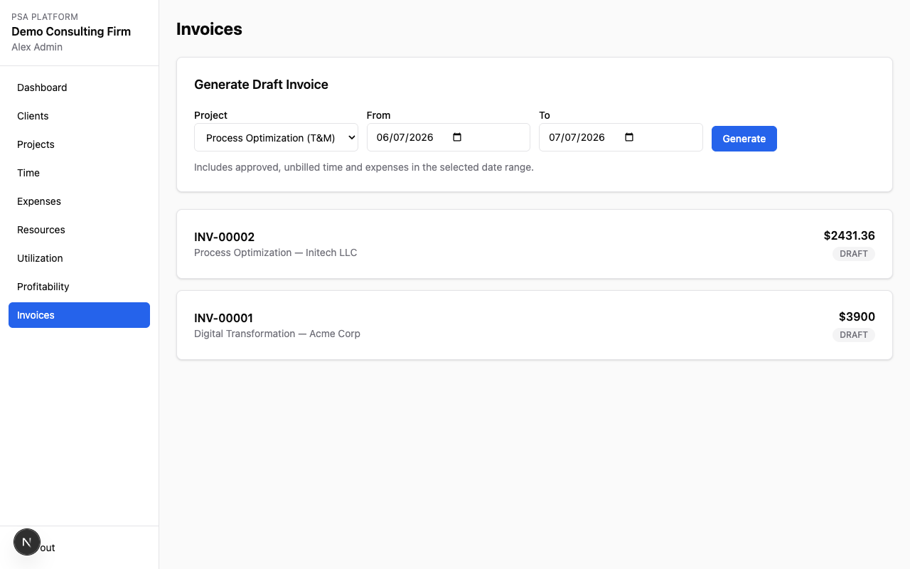
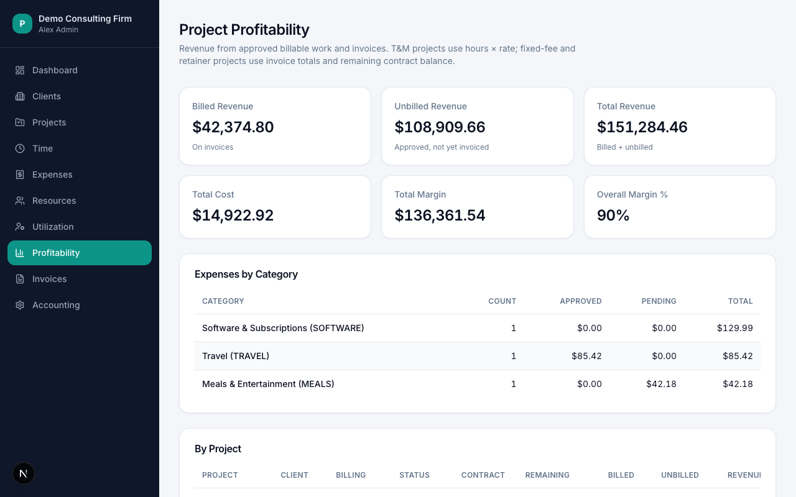

# Professional Service Automation (PSA)

[](https://github.com/SafetyMP/Professional-Service-Automation/actions/workflows/ci.yml)
[](LICENSE)
[](https://nodejs.org/)

Open-source Professional Services Automation platform for consulting and professional services firms. Manage clients, projects, time, expenses, resources, utilization, billing, and profitability in one multi-tenant web app.

<p align="center">
  
</p>

## Features

- **Multi-tenant organizations** with role-based access (Admin, Manager, Consultant)
- **Clients & projects** — tasks, team members, budgets, billing models (T&M, fixed fee, retainer)
- **Time & expenses** — entry workflows with manager approval
- **Resources** — profiles, allocations, utilization reporting
- **Billing** — draft invoices from approved WIP or contract/progress billing; PDF export; journal CSV
- **Reporting** — project profitability (billed vs unbilled), dashboard WIP metrics
- **Row-level security** — PostgreSQL RLS enforces organization isolation

## Screenshots

| Dashboard | Invoices | Profitability |
|-----------|----------|---------------|
|  |  |  |

## Stack

- [Next.js 16](https://nextjs.org/) (App Router) · [React 19](https://react.dev/) · [TypeScript 6](https://www.typescriptlang.org/)
- [PostgreSQL 16](https://www.postgresql.org/) · [Prisma 7](https://www.prisma.io/) · [Auth.js / NextAuth v5](https://authjs.dev/)
- [Tailwind CSS 4](https://tailwindcss.com/) · [Vitest](https://vitest.dev/)

## Prerequisites

- Node.js 22+ (see [`.nvmrc`](.nvmrc))
- Docker (for local Postgres) or an existing PostgreSQL 16 instance
- npm

## Quick start

```bash
git clone https://github.com/SafetyMP/Professional-Service-Automation.git
cd Professional-Service-Automation

cp .env.example .env
# Edit .env: set AUTH_SECRET (e.g. openssl rand -base64 32)

docker compose up -d

npm install
npm run db:migrate
npm run db:seed

npm run dev
# Default: http://localhost:3000 — use -p 3005 if port 3000 is taken
```

### Demo login

| Field | Value |
|-------|-------|
| Organization | `demo-firm` |
| Admin | `admin@demo.com` / `password123` |

**Do not use demo credentials in production.** Change passwords and rotate `AUTH_SECRET` before deploying.

## Environment variables

See [`.env.example`](.env.example):

| Variable | Purpose |
|----------|---------|
| `DATABASE_URL` | App database URL (RLS role `psa_app`) |
| `DIRECT_URL` | Direct Postgres URL for migrations (`postgres` superuser) |
| `AUTH_SECRET` | Session signing secret (required) |
| `AUTH_URL` | Public app URL (e.g. `http://localhost:3000`) |

Local Docker Postgres listens on **port 5440** (mapped from container 5432).

## Deploy

For production or a one-command demo stack (Postgres + app in Docker):

```bash
export AUTH_SECRET="$(openssl rand -base64 32)"
docker compose -f docker-compose.stack.yml up --build -d
# http://localhost:3000 — demo-firm / admin@demo.com / password123
```

See [`docs/deploy.md`](docs/deploy.md) for Railway, Fly.io, manual Node deployment, and the production checklist.

## Scripts

| Command | Description |
|---------|-------------|
| `npm run dev` | Prisma generate + Next.js dev server |
| `npm run build` | Production build |
| `npm run lint` | ESLint |
| `npm run typecheck` | TypeScript check |
| `npm run test` | Vitest unit tests |
| `npm run db:migrate` | Apply Prisma migrations |
| `npm run db:seed` | Reset and seed demo data |
| `npm run check:boundaries` | Module import boundary lint |
| `./scripts/verify.sh` | Full local verification gate |
| `npm run screenshots` | Capture README screenshots and demo GIF (requires running server) |

## Project layout

```
lib/           Domain services (clients, projects, time, billing, …)
src/app/       Next.js App Router pages and API routes
prisma/        Schema, migrations, RLS policies
specs/         Domain rules and product scope
tests/         Unit tests
scripts/       Seed, verify, boundary checks
```

Domain logic lives in `lib/<domain>/service.ts`. Cross-domain imports must go through public service files only (enforced by `scripts/check-boundaries.ts`).

## Contributing

Contributions are welcome. See [CONTRIBUTING.md](CONTRIBUTING.md) for setup, conventions, and the pull request checklist.

- [Q&A Discussions](https://github.com/SafetyMP/Professional-Service-Automation/discussions/categories/q-a)
- [Bug reports](.github/ISSUE_TEMPLATE/bug_report.yml)
- [Feature requests](.github/ISSUE_TEMPLATE/feature_request.yml)
- [Code of Conduct](CODE_OF_CONDUCT.md)

## Roadmap

Phase 1 (MVP) is implemented. Planned Phase 2 items are listed in [`specs/product/mvp-scope.md`](specs/product/mvp-scope.md), including accounting integrations, expanded expense UI, and general ledger support.

Release history: [CHANGELOG.md](CHANGELOG.md).

## CI

GitHub Actions runs `./scripts/verify.sh` on push and pull request with a Postgres service container. See [`.github/workflows/ci.yml`](.github/workflows/ci.yml).

## Documentation

- [`docs/deploy.md`](docs/deploy.md) — Docker, Railway, Fly.io, and production checklist
- [`docs/development.md`](docs/development.md) — local setup, architecture, testing, and common tasks
- [`AGENTS.md`](AGENTS.md) — agent/developer contract for this repo
- [`specs/domain/billing-rules.md`](specs/domain/billing-rules.md) — billing model rules
- [`specs/domain/profitability-rules.md`](specs/domain/profitability-rules.md) — profitability calculations

## Security

See [`SECURITY.md`](SECURITY.md) for reporting vulnerabilities.

## License

[Apache License 2.0](LICENSE)
